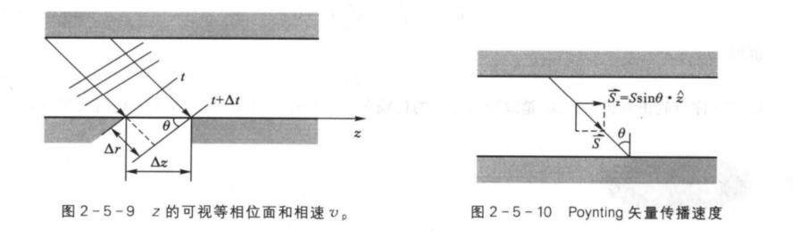
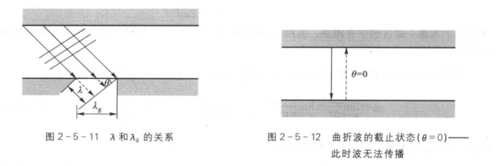

# TE10波的特点
我们已经知道，在波导一般解中：
$$
\triangledown ^2_t\vec e_t +k ^2_c\vec e_t = 0
$$
由分离变量得：
$$
k^2_c = k^2 + \gamma^2 = k^2 -\beta^2
$$
可以解得在TE模情况下：
$$
\begin{cases}
  L =\mu\iint\vec{h_t}\cdot\vec{h_t}dS = \mu  \\
  C = \epsilon\iint\vec{e_t}\cdot\vec{e_t}dS(\frac{\beta}{k})^2 = \epsilon(\frac{\lambda}{\lambda_g})^2
\end{cases}
$$
$$
\beta = \omega \sqrt{LC} = \frac{2\pi}{\lambda_g}
$$
所以波形阻抗为
$$
\eta = \sqrt{\frac{L}{C}} = \sqrt{\frac{\mu}{\epsilon}}(\frac{\lambda_g}{\lambda})
$$

而对于TM模情况下：
$$
\begin{cases}
    L= \mu(\frac{\lambda}{\lambda_g})^2
    \\ C = \epsilon
\end{cases}
$$
此时可以计算出：
$$
\begin{cases}
    \beta = \frac{2\pi}{\lambda_g}
    \\ \eta = \sqrt{\frac{\mu}{\epsilon}}(\frac{\lambda}{\lambda_g})
\end{cases}
$$
这就是其特性阻抗

对于平板波导z方向的等相位面：
$$
wt-kzsin\theta = Const
$$
对式子两端求微分得：
$$
wdt-ksin\theta dz =0
$$
故相速度：
$$
v_p = \frac{dz}{dt} = \frac{\omega}{ksin\theta} = \frac{c}{\sqrt{1-(\frac{\lambda}{2a})^2}}>c
$$
波导波长：
$$
\lambda_g = \frac{\lambda}{sin\theta} = \frac{\lambda}{\sqrt{1-(\frac{\lambda}{2a})^2}}>\lambda
$$
### 波的截止

当$\theta = 0$时波无法向前传播，此时波截止
此时：
$$
sin\theta = \sqrt{1-(\frac{\lambda}{2a})^2} = 0
$$
即：
$$
\lambda = \lambda_c = 2a
$$
此时
$$
\lambda_c = 2a
$$
为截止波长