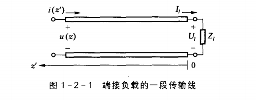
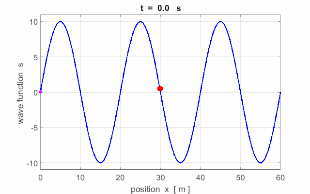
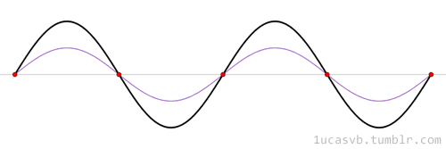

## 传输线的行波状态

### 一、之前学过的知识：
对接上负载的一段传输线：

在传输线上的电压和电流可以表示为：
$$
u(z) = A_1e^{-j\beta z}+A_2e^{j\beta z} = \frac{1}{2}(U_l+Z_0I_l)e^{j\beta z'}+\frac{1}{2}(U_l-Z_0I_l)e^{-j\beta z'}=u^+(0)e^{j\beta z'}+u^-(0)e^{-j\beta z'}
$$
$$
i(z) = \frac{u(z)}{Z_0}
$$
终端的反射系数
$$
\Gamma _l = \frac{Z_l-Z_0}{Z_l+Z0}  = \frac{u^-(0)e^{-j\beta z'}}{u^+(0)e^{j\beta z'}}
$$
### 二、行波状态：
#### 1.行波和驻波是什么

#### 2.满足的条件
此时
$$
u^-(0)e^{-j\beta z'}=0
$$
$$
\Gamma _l = \frac{Z_l-Z_0}{Z_l+Z0}=0
$$
$$
Z_l = Z_0
$$
代入到电压和电流的表达式中：
$$
u(z) = \frac{1}{2}(U_l+Z_0I_l)e^{j\beta z}=u^+(0)e^{j\beta z}
$$
$$
i(z) = \frac{1}{2Z_0}(U_l+Z_0I_l)e^{j\beta z}=I^+(0)e^{j\beta z}
$$
写成瞬态形式之后：
$$
u(z,t) = |U_0^+|cos(\omega t-\beta z +\varphi _0)
$$
$$
i(z,t) = |I_0^+|cos(\omega t-\beta z +\varphi _0)
$$

